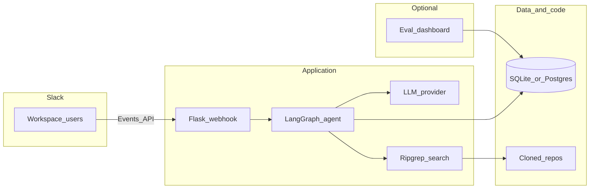
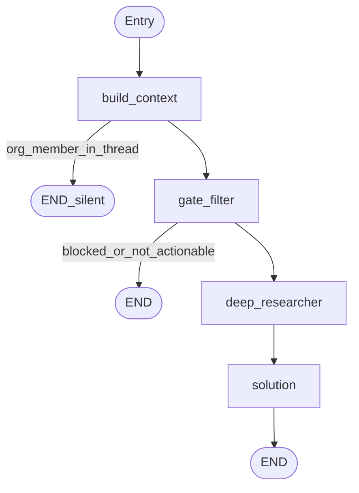

# Slack Community Agent

An AI-powered Slack agent that answers support questions by searching your codebase with [ripgrep](https://github.com/BurntSushi/ripgrep) across cloned GitHub repositories. The design is product-agnostic: adapt it to any organization by editing files under `config/`.

## Features

- **Deep researcher** — Iterative search loop driven by an LLM; stops when retrieval has enough signal.
- **Gate filter** — Classifies each message (relevant, actionable, harmful) before expensive work runs.
- **Thread memory** — Summarizes conversation history so context persists across turns.
- **Multiple LLM providers** — Gemini, OpenAI, OpenRouter, or Ollama.
- **Dual database** — SQLite for local development; PostgreSQL for Docker and production.
- **Evaluation dashboard** — FastAPI UI for reviewing questions and answers.

## Architecture

### System overview

The Slack Events API delivers messages to a small Flask webhook. The request is executed through a **LangGraph** workflow that loads thread context, filters noise, runs grounded research over local clones, and posts a reply. Persistence (threads, messages, summaries) uses SQLite or PostgreSQL. The evaluation dashboard can be run locally against the same database (see below).



### Agent graph

The production graph is defined in [`agent/graph.py`](agent/graph.py). **build_context** loads history and detects when an organization member has already replied (the agent stays silent). **gate_filter** blocks harmful or irrelevant traffic and ignores non-actionable noise. **deep_researcher** plans searches and file reads. **solution** composes the final answer.



## Project structure

```
slack-agent/
├── agent/                    # Core runtime
│   ├── nodes/                # LangGraph nodes (incl. cli/ variants)
│   └── utils/                # Shared helpers (e.g. JSON parsing)
├── config/                   # White-label content (no code changes)
│   ├── agent.yaml
│   ├── about.md
│   ├── repos.md
│   ├── repos.yaml
│   ├── team.json
│   └── terminal_allowed_commands.yaml
├── docker/                   # Container images
├── docs/                     # CLI quickstart, terminal tool
├── eval_app/                 # Evaluation dashboard (FastAPI)
├── scripts/                  # Repo sync and local startup
├── tests/
├── docker-compose.yml
├── pyproject.toml
└── .env.example
```

## Prerequisites

- Python 3.11+
- [uv](https://docs.astral.sh/uv/)
- [ripgrep](https://github.com/BurntSushi/ripgrep)
- A [Slack app](https://api.slack.com/apps) with an OAuth token and signing secret
- An LLM API key (Gemini, OpenAI, OpenRouter) or local Ollama

## Installation

```bash
uv sync
cp .env.example .env
# Edit .env: Slack credentials, LLM keys, optional DATABASE_URL
```

Optional: customize `config/agent.yaml`, `config/about.md`, `config/repos.md`, `config/repos.yaml`, and `config/team.json` for your product and repositories.

## Usage

### Webhook server (production)

```bash
uv run python -m agent.main
uv run python -m agent.main --port 8001
uv run python -m agent.main --validate-config
```

Entry point alias: `uv run slack-agent` (see [`pyproject.toml`](pyproject.toml)).

### Interactive CLI (local testing)

```bash
./scripts/start.sh
uv run python agent/cli_chat.py
```

See [`docs/QUICKSTART_CLI.md`](docs/QUICKSTART_CLI.md) for CLI-focused setup.

### Public URL for Slack (development)

```bash
ngrok http 8001
# Slack Request URL: https://<your-subdomain>.ngrok.io/slack/events
```

### Testing

```bash
uv run python tests/test_agent.py "Your question here"
uv run pytest tests/ -v
```

### Docker

The stack pulls **PostgreSQL** from Docker Hub (`postgres:16-alpine`), **Ollama** (`ollama/ollama`) for optional local LLM inference, and the **agent** from a published image (default `olake/slack-agent:latest`, multi-arch **linux/amd64** and **linux/arm64**). No local `docker build` is required for a normal start.

Ollama starts with the stack; set `LLM_PROVIDER=ollama` in [`docker-compose.yml`](docker-compose.yml) under `x-app-environment` (or export it) and ensure a model is available, for example:

```bash
docker compose exec ollama ollama pull llama3.2
```

The agent uses `OLLAMA_BASE_URL=http://ollama:11434/v1` inside the compose network. On the host, the Ollama API is at port **11434** by default (`OLLAMA_PORT`).

```bash
docker compose up -d
```

Use another registry or namespace:

```bash
export SLACK_AGENT_IMAGE=yourdockerhub/slack-agent:latest
docker compose up -d
```

**Publish** a new image (requires Docker Hub login and a repository under your account):

```bash
export SLACK_AGENT_IMAGE=yourdockerhub/slack-agent
./scripts/docker-build-push-agent.sh
```

**Build locally** instead of pulling (for example when the Hub image is not available yet):

```bash
docker compose -f docker-compose.yml -f docker-compose.build.yml up --build -d
```

**Configuration:** Docker Compose does not use `env_file`. Shared settings live under `x-app-environment` in [`docker-compose.yml`](docker-compose.yml); edit the YAML (or export variables with the same names before `docker compose up`—Compose substitutes `${VAR}` and `${VAR:-default}` from your shell). `DATABASE_URL` is set for in-stack Postgres automatically.

**Ports (host):** Postgres **5433**, agent webhook **8001**, Ollama **11434**—override with `POSTGRES_PORT`, `WEBHOOK_PORT`, and `OLLAMA_PORT` when invoking Compose.

## Configuration

For **local runs** (`uv run …`), copy [`.env.example`](.env.example) to `.env` and adjust values. For **Docker**, use the compose file as above.

Common environment variables (also listed in `.env.example`):


| Variable | Description |
| --- | --- |
| `LLM_PROVIDER` | `gemini` \| `openai` \| `openrouter` \| `ollama` |
| `GEMINI_API_KEY` / `OPENAI_API_KEY` / `OPENROUTER_API_KEY` | Provider API keys |
| `OPENROUTER_MODEL` | Model when using OpenRouter |
| `OLLAMA_BASE_URL` / `OLLAMA_MODEL` | Local Ollama |
| `SLACK_BOT_TOKEN` | OAuth token (`xoxb-…`) |
| `SLACK_SIGNING_SECRET` | Request verification |
| `DATABASE_URL` | PostgreSQL DSN; omit for SQLite |
| `AGENT_NAME` | Overrides `config/agent.yaml` |
| `COMPANY_NAME` | Overrides `config/agent.yaml` |

Required Slack token scopes: `chat:write`, `reactions:write`, `users:read`.

## White-labeling

Adjust the files in `config/` to match your organization. No Python changes are required for name, voice, product copy, repository list, or the team list used to suppress duplicate replies from the agent when a teammate has already responded.

## Evaluation dashboard

```bash
uv run eval-dashboard
# http://localhost:${EVAL_APP_PORT:-8000}
```

Point `DATABASE_URL` (or `DATABASE_PATH` for SQLite) at the same store as your agent so the dashboard reflects production data.

## References

- [LangGraph](https://python.langchain.com/docs/langgraph/)
- [Slack API](https://api.slack.com/)
- [uv](https://docs.astral.sh/uv/)
